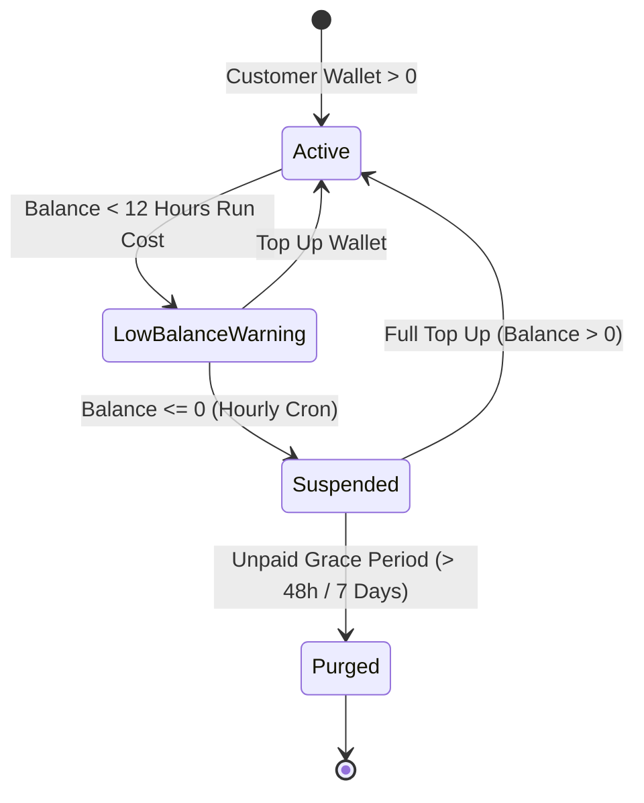

# ArvanCloud Service Termination & Suspension Policies

## 1. Overview & Legal Framework

According to **ArvanCloud's Official Terms of Service and Service Termination Policy** (`https://www.arvancloud.ir/fa/legal/service-termination`), cloud infrastructure resources consume credit continuously under a **Pay-As-You-Go (PAYG)** metered billing model. 

When a user's wallet balance drops below zero (becomes negative/debtor), ArvanCloud dispatches automated warning notifications (via Email and SMS) and triggers a multi-stage deactivation, lock, and purge lifecycle.

> **Important Legal Notice from ArvanCloud:**
> *ArvanCloud assumes no liability or responsibility for customer data loss resulting from the permanent deletion/purging of cloud resources due to prolonged negative account balance.*

---

## 2. Cloud Server Service Termination Matrix

| Cloud Product | Immediately on Negative Balance | After 2 Hours | After 24 Hours | After 48 Hours | After 1 Week |
| :--- | :--- | :--- | :--- | :--- | :--- |
| **Cloud Server (سرور ابری — ECC)** | Control panel actions restricted | Instance network disconnected (by user tier) | &mdash; | **Virtual instances powered off** | **Instances, snapshots, backups, disks, IPs permanently deleted** |

---

## 3. Reseller Plugin Implementation Rules

To maintain strict alignment with ArvanCloud's upstream policies and safeguard reseller finances, the `arv-seller` plugin implements the following lifecycle automation:

### 3.1 Stage 1: Threshold Warning ($\text{Balance} < 12\text{ hours}$)
* The plugin checks the current burn rate ($R = \sum \text{hourly\_cost}$).
* When $\text{Balance} < (12 \times R)$, a high-visibility amber warning banner is displayed across the Customer Dashboard prompting an immediate wallet top-up.

### 3.2 Stage 2: Immediate Suspension ($\text{Balance} \le 0$)
* Executed by the hourly cron daemon (`arvan_hourly_metering_cron`) in [class-arvan-metering.php](file:///c:/Users/reza2/Local%20Sites/seller/app/public/wp-content/plugins/arv-seller/includes/class-arvan-metering.php).
* **Actions Taken:**
  1. `status` in `wp_arvan_resources` is updated to `'suspended'`.
  2. Dispatches `POST /ecc/v1/regions/{region}/servers/{id}/power-off` via [Arvan_API_Client](file:///c:/Users/reza2/Local%20Sites/seller/app/public/wp-content/plugins/arv-seller/includes/class-arvan-api-client.php).
  3. Locks frontend configurators and resource controls to **Read-Only Lock Mode**.
  4. Red warning banner displayed: *"Your cloud services are suspended due to insufficient wallet balance. Please top up your wallet to restore access."*

### 3.3 Stage 3: Immediate Auto-Recovery upon Top-Up
* As soon as the customer completes a payment top-up via online IPG gateway and $\text{Balance} > 0$:
  * Customer is granted permission to power on instances with a single click in the dashboard.
  * Status in `wp_arvan_resources` transitions back to `'active'`.

### 3.4 Stage 4: Admin Purge Notice
* If an account remains in negative balance beyond the 7-day grace period, the administrator is alerted in the **WP Admin > Arvan Reseller > Cloud Resources** tab to execute permanent resource deletion via `DELETE /ecc/v1/regions/{region}/servers/{id}` to avoid upstream charges on the reseller master account.
